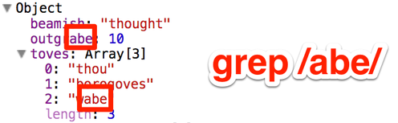
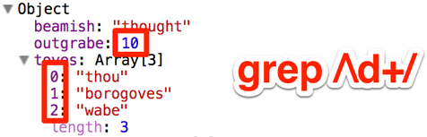

## Search inside JavaScript objects

The command line has `grep`, so why doesn't JavaScript?

If you work with big objects (such as those in client-side MVC
libraries) you might wonder where certain properties end up living on
your JS objects. Wouldn't it be nice to just grep the objects to find
strings you know are in there somewhere?

### Usage

Run this bookmarklet.

    javascript:(function%20()%20%7Bvar%20script%20=%20document.createElement(%22script%22);script.src%20=%20%22https://raw.github.com/begriffs/objgrep/master/objgrep.js%22;document.getElementsByTagName(%22head%22)[0].appendChild(script);%7D());

It adds a `.grep` method to every object which you can use in the Chrome
console. **For example** let's define a `foo` object.

    var foo = { beamish: 'thought', outgrabe: 10, toves: ['thou', 'borogoves', 'wabe'] };

After running the bookmarklet, you can grep the object:

    foo.grep(/abe/);
    // returns [".outgrabe", ".toves[2]"]

    foo.grep(/\d+/);
    // returns [".outgrabe", ".toves[0]", ".toves[1]", ".toves[2]"]

You can use it on the dom, or on any object really. It accepts a
`depth` option to limit search depth and avoid getting caught in cyclic
references. If you don't specify a depth it defaults to five.

    // searches with depth at most two
    foo.grep(/abe/, 2);
    // returns [".outgrabe"]

### License

Objgrep is Copyright © 2013 Joe Nelson. It is free software, and may be
redistributed under the terms specified in the LICENSE file.
